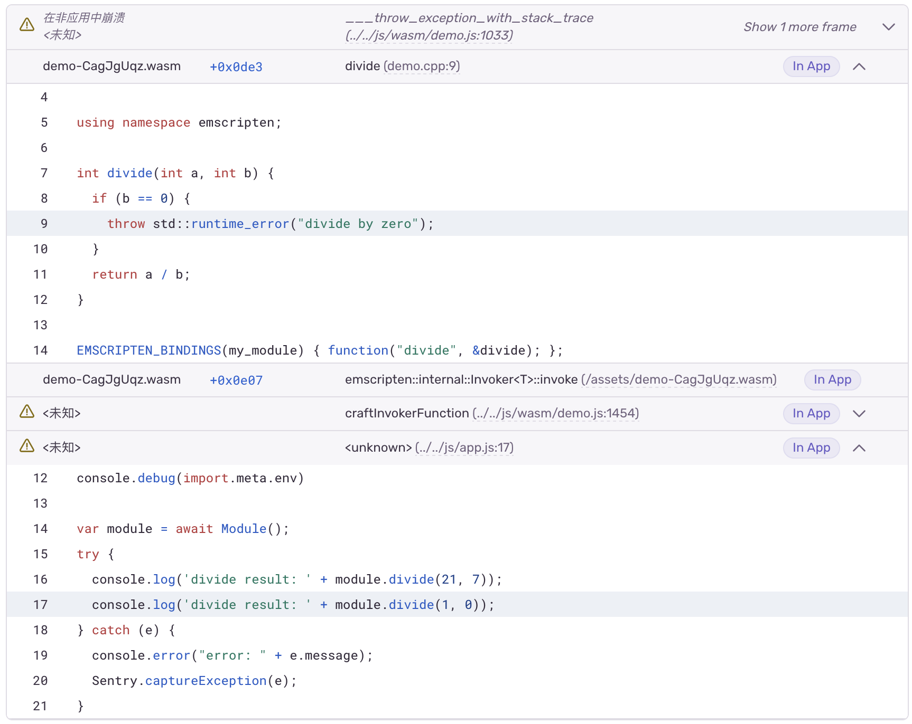
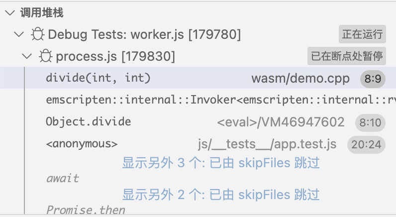
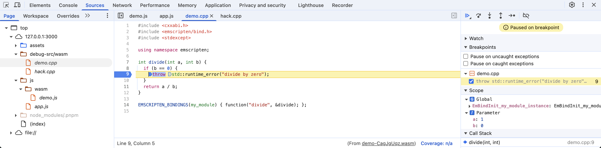

# Emscripten Demo

[中文版](/README_zh.md)

This project demonstrates a minimal setup for an Emscripten-based WebAssembly (Wasm) application. It features a C++ `divide` function called from JavaScript, showcasing a typical engineering setup for similar projects.

## Features

* **Minimal Project Setup**: Uses CMake for C++ build, Vite for frontend bundling, and Vitest for testing.
* **Optimized Wasm**: Uses `wasm-split` to strip debug information from the Wasm module at build time, preventing sensitive information leakage in production.
* **Sentry Integration**: Captures C++ exceptions and sends them to Sentry with full JavaScript and C++ stack traces (utilizing sourcemaps and debug files).
* **IDE Integration**: Configured for `clangd` integration in editors like VSCode, enabling features like code navigation and auto-completion for C++ code.
* **VSCode Debugging**: Supports debugging C++ code with breakpoints in VSCode, for instance, when running Vitest tests.
* **Chrome DevTools Debugging**: Supports debugging C++ code in Chrome using the C/C++ DevTools Support (DWARF) extension.

## Usage

Prepare dependencies and configuration files:

```bash
$ direnv allow .
$ make init
$ cp .env.example .env
$ cp .sentryclirc.example .sentryclirc
$ vim .env  # Set Sentry DSN
$ vim .sentryclirc  # Set Sentry org, project, and auth token
```

Install wasm-split: https://github.com/getsentry/symbolicator/releases/.

Build the project, and upload sourcemaps and debug files to Sentry:

```bash
$ make build upload
```

Run the development server:

```bash
$ make dev
```

Or run the preview server:

```bash
$ make preview
```

Open `http://localhost:3000` in your browser. An event will be sent to Sentry if an error occurs (e.g., division by zero).

## Use Cases

### 1. Sentry Exception Reporting for C++ Code

When a C++ exception occurs, it's captured and sent to Sentry. The Sentry event will display a full stack trace, including both JavaScript and C++ frames, with source code context and function names, thanks to sourcemaps and debug files.



### 2. Debugging C++ in VSCode-like Editors

You can debug C++ code directly within VSCode or other compatible editors. Set breakpoints, inspect variables, and step through your C++ code seamlessly.

However, due to a limitation in the debugging extension ([microsoft/vscode-dwarf-debugging-ext#8](https://github.com/microsoft/vscode-dwarf-debugging-ext/issues/8)), the external debug Wasm generated by `wasm-split` might not work correctly. For effective debugging in such editors, you may need to replace `js/wasm/demo.wasm` with `js/wasm/demo.debug.wasm` (which contains embedded DWARF information).



### 3. Debugging C++ in Chrome Browser

Chrome DevTools, with the C/C++ DevTools Support (DWARF) extension, allows for debugging C++ code.

To be able to debug C++ code in Chrome during SSH remote development, you also need to:
1. Host the source code directory on port 3001. For example:
   ```bash
   $ python3 -m http.server 3001
   ```
2. In the C/C++ DevTools Support (DWARF) extension settings, map `/path/to/your/code` (the absolute path to your source code on the machine where the `python3 -m http.server 3001` command is run) to `http://localhost:3000/debug-src/`.



## References

- [Chrome Blog - Faster Wasm Debugging](https://developer.chrome.com/blog/faster-wasm-debugging)
- [Emscripten - Call C++ Code from Javascript](https://emscripten.org/docs/porting/connecting_cpp_and_javascript/embind.html)
- [Emscripten - C++ Exception Support](https://emscripten.org/docs/porting/exceptions.html)
- [VSCode - Debugging WebAssembly](https://code.visualstudio.com/docs/nodejs/nodejs-debugging#_debugging-webassembly)
