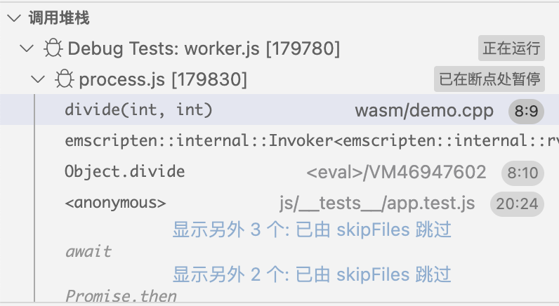
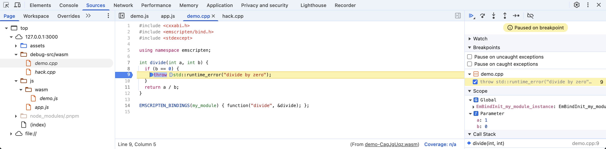

# Emscripten 演示

本项目演示了一个基于 Emscripten 的 WebAssembly (Wasm) 应用的最小化配置。它包含一个由 JavaScript 调用的 C++ `divide` 函数，展示了类似项目的典型工程实践。

## 特性

* **最小化项目配置**：使用 CMake 进行 C++ 构建，Vite 进行前端打包，Vitest 进行测试。
* **优化 Wasm**：在编译时使用 `wasm-split` 去除 Wasm 模块中的调试信息，避免在生产环境中泄露敏感信息。
* **Sentry 集成**：捕获 C++ 异常并将其发送到 Sentry，能够完整展示 JavaScript 和 C++ 的错误堆栈（利用 sourcemap 和调试文件）。
* **IDE 集成**：为 VSCode 等编辑器配置了 `clangd` 集成，支持 C++ 代码的函数跳转、自动补全等功能。
* **VSCode 调试**：支持在 VSCode 中对 C++ 代码进行断点调试，例如在运行 Vitest 测试时。
* **Chrome DevTools 调试**：支持在 Chrome 中使用 C/C++ DevTools Support (DWARF) 扩展程序对 C++ 文件进行调试。

## 使用方法

准备依赖和配置文件：

```bash
$ direnv allow .
$ make init
$ cp .env.example .env
$ cp .sentryclirc.example .sentryclirc
$ vim .env  # 设置 Sentry DSN
$ vim .sentryclirc  # 设置 Sentry org, project, 和 auth token
```

安装 wasm-split: https://github.com/getsentry/symbolicator/releases/

构建项目，并上传 sourcemap 和调试文件到 Sentry：

```bash
$ make build upload
```

启动开发服务器：

```bash
$ make dev
```

或者启动预览服务器：

```bash
$ make preview
```

在浏览器中打开 `http://localhost:3000`。如果发生错误（例如除以零），将会向 Sentry 发送一个事件。

## 使用场景

### 1. C++ 异常的 Sentry 事件上报

当 C++ 发生异常时，它会被捕获并发送到 Sentry。得益于 sourcemap 和调试文件，Sentry 事件将展示完整的堆栈跟踪，包括 JavaScript 和 C++ 的帧，以及源代码上下文和函数名。


### 2. 在类 VSCode 编辑器中调试 C++

你可以直接在 VSCode 或其他兼容编辑器中调试 C++ 代码。无缝地设置断点、检查变量并单步执行 C++ 代码。

然而，由于调试插件的限制 ([microsoft/vscode-dwarf-debugging-ext#8](https://github.com/microsoft/vscode-dwarf-debugging-ext/issues/8))，`wasm-split` 生成的外部调试 Wasm 可能无法正常工作。为了在此类编辑器中进行有效调试，你可能需要将 `js/wasm/demo.wasm` 替换为 `js/wasm/demo.debug.wasm`（其中包含嵌入式 DWARF 信息）。



### 3. 在 Chrome 浏览器中调试 C++

Chrome DevTools 配合 C/C++ DevTools Support (DWARF) 扩展程序，可以调试 C++ 代码。

如果在使用 SSH 远程开发时，需要在 Chrome 中调试 C++ 程序，你还需要：
1. 将源代码目录 host 到 3001 端口。例如：
   ```bash
   $ python3 -m http.server 3001
   ```
2. 在 C/C++ DevTools Support (DWARF) 扩展程序的设置中，将 `/path/to/your/code` （运行 `python3 -m http.server 3001` 命令的机器上源代码的绝对路径）映射到 `http://localhost:3000/debug-src/`。



## 参考资料

- [Chrome 博客 - 更快的 Wasm 调试](https://developer.chrome.com/blog/faster-wasm-debugging)
- [Emscripten - 从 Javascript 调用 C++ 代码](https://emscripten.org/docs/porting/connecting_cpp_and_javascript/embind.html)
- [Emscripten - C++ 异常支持](https://emscripten.org/docs/porting/exceptions.html)
- [VSCode - 调试 WebAssembly](https://code.visualstudio.com/docs/nodejs/nodejs-debugging#_debugging-webassembly) 
